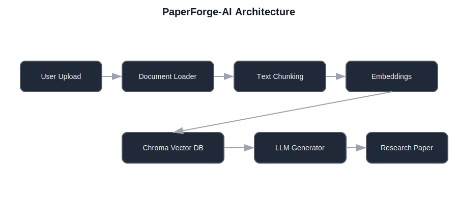

# 🧠 PaperForge-AI  
### AI-Powered Research Paper Generator from Uploaded Documents

PaperForge-AI is an end-to-end AI research assistant that transforms uploaded documents (PDF, DOCX, TXT, MD) into a structured academic-style research paper using Retrieval-Augmented Generation (RAG). It combines semantic search and LLM reasoning to synthesize knowledge into a coherent research document.

🔗 **Live Demo:** https://paperforge-ai.streamlit.app/

---

## 🚀 Features

- Upload multiple documents (PDF / DOCX / TXT / MD)
- Semantic vector search using embeddings
- AI-generated research paper synthesis
- Persistent Chroma vector database
- Optimized chunking + retrieval pipeline
- Streamlit web interface
- Secure API key loading via `.env`
- Structured academic-style output

---

## 🧩 How It Works

PaperForge-AI follows a Retrieval-Augmented Generation pipeline:

1. User uploads documents
2. Documents are chunked into smaller segments
3. Text chunks are embedded using OpenAI embeddings
4. Stored inside a Chroma vector database
5. Relevant chunks are retrieved
6. LLM generates a research paper
7. Final paper is displayed to the user

---

## 🏗 Architecture Diagram



---

## 🧪 Tech Stack

- Python
- Streamlit
- LangChain
- ChromaDB
- OpenAI API
- Python-dotenv
- PyPDF / Docx loaders

---

## 📦 Installation

Clone the repository:

```bash
git clone https://github.com/Meet-Amin/PaperForge-AI.git
cd PaperForge-AI
```

Create a virtual environment:

```bash
python -m venv .venv
source .venv/bin/activate   # macOS/Linux
.venv\Scripts\activate      # Windows
```

Install dependencies:

```bash
pip install -U streamlit python-dotenv langchain langchain-openai langchain-chroma langchain-community unstructured pypdf python-docx reportlab
```

---

## 🔐 Environment Setup

Create a `.env` file in the project root:

```
OPENAI_API_KEY=your_api_key_here
```

⚠️ Never commit this file to GitHub.

---

## ▶️ Run the App

```bash
streamlit run streamlit_research_paper_app.py
```

The app will open in your browser.

---

## 📂 Project Structure

```
PaperForge-AI/
│
├── streamlit_research_paper_app.py
├── uploads/
├── db/chroma_db/
├── .env
└── README.md
```

---

## 🎯 Use Cases

- Academic research drafting
- Literature synthesis
- Student research assistance
- Report generation
- Knowledge extraction from documents

---

## 🔮 Future Improvements

- Citation formatting (APA / IEEE)
- PDF export
- Research outline mode
- Multi-agent writing pipeline
- Reference manager integration
- Custom writing styles

---

## 👤 Author

**Meet Amin**  
AI Engineer | RAG Systems | LLM Applications  
GitHub: https://github.com/Meet-Amin

---

## ⭐ Support

If you like this project, consider starring the repo.

---

## 📜 License

MIT License
